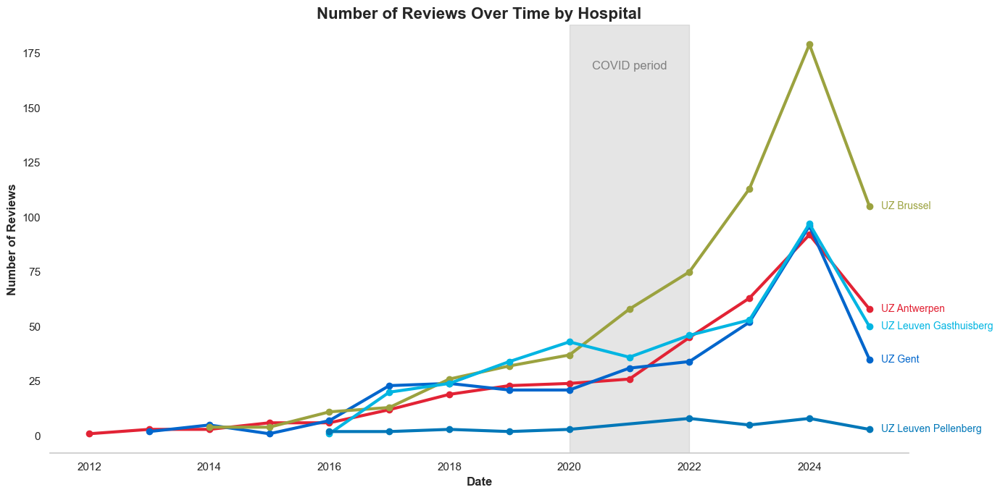
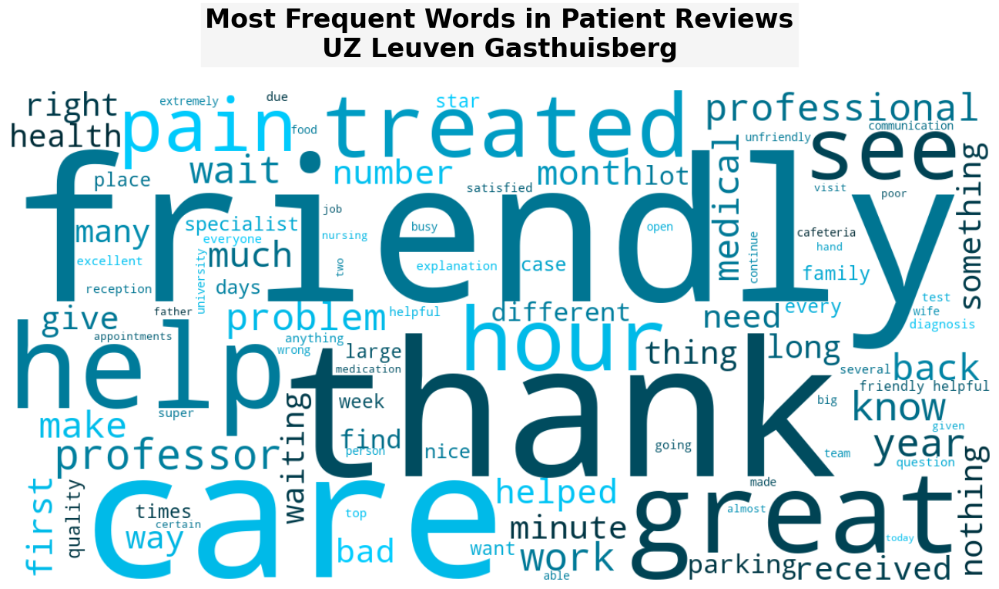
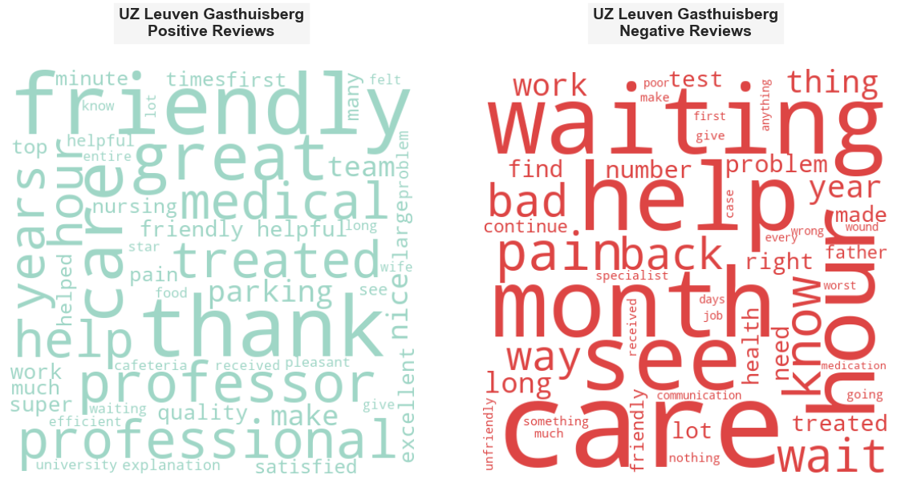

# What do people think about university hospitals in Flanders and Brussels?

In this project, I looked into reviews on Google Maps for five university hospitals in Flanders and Brussels (Belgium): UZ Brussel (VUB), UZ Leuven campus Gasthuisberg and campus Pellenberg (KU Leuven), UZ Gent (Ghent University) and UZ Antwerpen (University of Antwerp). Using web-scraped review data, I answered the questions:

- What did people normally talk about these university hospitals?
- How did they feel about when they visited these hospitals?

Combining natural language processing (NLP) and visualizations, I uncovered key themes, tracked sentiment trends over time, and identified areas for improvement. The insights will help understand the experiences of patients and visitors better, identify the pain points and improve healthcare services accordingly.

## Data Collection via Web Scraping and Data Cleaning

After identifying the list of university hospitals in Flanders and Brussels, I searched for them on Google Maps with the hopsital names. All the reviews for individual hospitals were scraped on 10 July 2025 using Instant Data Scraper, a Chrome extensions that allows to scrape data from web pages. The data was then downloaded into csv files.

Next, each dataframe of individual hopsital was cleaned to retain only relevant columns and parse the date. I kept and renamed the columns ``reviewer``, ``date``, ``original language`` and ``content of review``. As I wanted to implement text-based analytics, I removed any reviews without text (aka those with only ratings). One limits of this project is that the reviews scraped were not in their original languages, due to automatic translation function of Google Maps. Another shortcoming: due to relative date shown on Google Maps, it was difficult to extract the exact date or month of the reviews. Hence, I only kept the year for trend analysis later. Individual dataframes were merged into one single dataframe, having an extra column to indicate the hospital for which the review was written for. 

The final dataset ready for text mining and sentiment analysis consisted of 1830 reviews for all five hospitals in total and five columns: ``reviewer``, ``year``, ``original language``, ``content``, ``hospital``.

-----

## Attention and Engagement from Patients
Overal there were more and more reviews written over time on Google Maps. The sharp rise in the number of reviews started in 2021 and reached the peak in 2024.

Among the hospitals, UZ Brussels received the most reviews, with ≈180 reviews in 2024 while UZ Leuven Gasthuisberg, UZ Gent and UZ Antwerpen had ≈100 reviews in the same year. It seems that smaller hospital like UZ Leuven Pellenberg might have been visited less and thus, received fewer reviews.

-----

## What Did People Talk About?

Text cleaning for word clouds and topic modeling included noise and stopword removal, number removal, normalization and tokenization. For each hopsital, word cloud was generated to identify most frequent words over reviews and topic modeling was implemented using Latent Dirichlet Allocation (LDA) to discover hidden topics within a collections of reviews.

Positive adjectives (eg. "friendly", "professional", "nice", "great"), together with healthcare-related words (eg. "pain", "medical", "test", "treated", "help", "care") appeared as the most frequent terms across reviews for all hopsitals. "Thank" also consistently mentioned across the reviews.

 

Time-related words (eg. "hour", "minute", "week", "month", "year", "wait") were also dominant in the corpus. Personel such as "nurse", "surgeon", "professor" were regualrly mentioned in the reviews in general.

 

Regarding UZ Gent, "parking" was one of the most mentioned. There might be complaints as well, as negative adjectives such as "bad", "unfriendly" and "long" were frequently used.

Overall, word clouds hinted that there are mixed opinions about the hospital service quality and experiences. Hospital and healthcare-specific categories in staff, time and facilities also emerged as dominant topics that people talked about.

For topic modeling, I trained a LDA model to uncover three hidden topics for each hospital. While some topics such as waiting, staff friendliness and expression of gratitude overlap across hopsitals, there are certain distinctive focal points at each hospital.

At UZ Brussel, long waiting times and frustrating experiences (topic 1) were prominent while at UZ Antwerpen, waiting and communication issues emerged more clearly (topic 3). Similar to word clouds, topic modeling showed mixed experiences of patients and visitors.

 

-----

## What Did People Feel?

I employed lexicon and Transformers to identify the sentiment for each review. Valence Aware Dictionary and sEntiment Reasoner (VADER) is a lexicon-based model trained on social media texts (microblogs) that takes into account negation, intensifiers, emojis, emoticons and so on. This approach is fast due to no model training or finetuning required and generalizable. However, it required minor text preprocessing.

For Transformers-based approach, I used DistilBERT model as this is light to run on my local machine. Future project can experiment with other models and/or finetune for the specific downstream task. Despite not being finetuned, the pre-trained model is context-aware within each review.

All hospitals, except for UZ Brussel, had more than half of their reviews are positive. The sentiment distribution graph also shows that there is a significant gap between VADER and DistilBERT approaches. VADER method tends to classifiy more reviews as positive, especially for UZ Gent and UZ Leuven Pellenberg, compared to DistilBERT. On the other hand, VADER model was able to identify neutral reviews while DistilBERT could only classify reviews into binary classes "positive" or "negative". This demonstrates that the model choice will influence the perceived sentiment trends.

To investigate into the gap between the two models, let's look at the confusion matrix between VADER and DistilBERT. The heatmap confirms the discrepancy between the two models. There were 850 positive reviews and 429 negative reviews, meaning that ≈70% of total reviews were agreed by both models.

The violin plot indicates that DistilBERT predictions had very high confidence scores (close to 1) for both positive and negative sentiments, suggesting that the model was highly certain in its classifications.

-----

## Sentiment Dynamics Over Time

Based on the proportion of sentiment trends, we see that the sentiment fluctuated over time, with best resutls in 2015 (80% were positive). The discrepancy between positive and negative opinions was increasingly narrowed over years. As of 2022, which marked the so-called end of COVID-19 period, there were as many positive reviews as negative ones. The balance between pleasant and unpleasant experiences continued in the next three years.

 

 

The highest proportion of positive reviews at UZ Brussel, UZ Gent, UZ Leuven Gasthuisberg, UZ Leuven Pellenberg and UZ Antwerpen occured in 2017, 2015, 2016, 2017 and 2014 respectively. During COVID-19 pandemic, the proportion of positive reviews at UZ Gent and UZ Leuven Penllenberg decreased while fluctuating at the other hospitals.

-----

## What Did They Said in Positive and Negative Reviews?

Positive words related to personnel, like "friendly", "professional", "helpful", "attentive" and "team", and gratitude expressions, such as "thank" and "satisfied", show that patients and visitors appreciate staff's professionalism, kindness and teamwork. Positive reviews center on interpersonal qualities and professional care indicated the strength in patient-facing interactions.

 

On the other hand, common negative words, including “waiting,” “hour,” “bad,” “pain,” “problem,” and “parking” highlight operational issues rather than clinical care. Negative reviews highlight recurring themes of waiting times and logistics (parking, communication delays), pointing to concrete areas for operational improvements.

 

